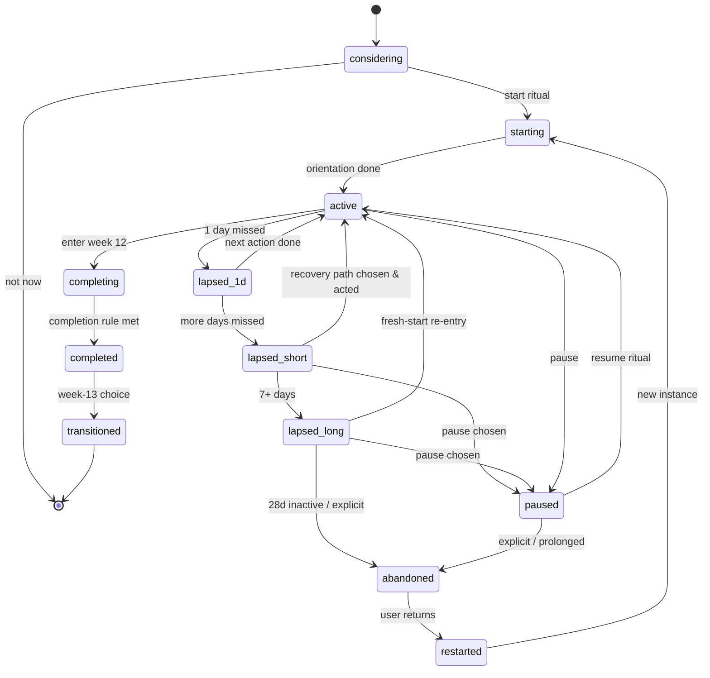

# Challenge Lifecycle

**Status:** Draft for Gate 2. The user-side state machine: one user's enactment of one ProgrammeVersion. Programme (content-side) lifecycle lives in the engine spec §4 and `07-architecture/state-machines.md`. Every transition here has a designed experience — lapse states are product, not errors (D-002).

## 1. States

| State | Meaning | User experience |
|-------|---------|-----------------|
| `considering` | Programme opened, suitability seen, not started | Catalogue detail; honest expectations |
| `starting` | Committed; orientation underway | Orientation, goal framing, schedule setup, start-date choice |
| `active` | In the journey (week w, day d) | The daily loop |
| `lapsed_1d` | One scheduled day missed | Invisible as a "state" — tomorrow simply acknowledges and continues (no ceremony) |
| `lapsed_short` | 2–6 scheduled days missed | Recovery conversation on next open + one calm re-entry notification (if enabled) |
| `lapsed_long` | 7+ days missed | Fresh-start re-entry offer; journey preserved |
| `paused` | Explicit pause | Honest pause: schedule shifts, no decay mechanics, gentle return date suggestion (user-set) |
| `completing` | Week 12 in progress | Completion arc: final checkpoint, report assembly |
| `completed` | Completion rule met | Week-12 experience; report; week-13 transition |
| `transitioned` | Week-13 choice made | Next challenge / maintenance / clean end — all first-class |
| `abandoned` | Explicit quit, or 28 days inactive | Respectful close; everything preserved; return path always open |
| `restarted` | New challenge instance from same programme | Fresh start with history honoured ("second journey"), never erased |

## 2. State machine

## 3. Transition rules that matter

- **Missed-day detection** counts *scheduled* days only — rest days and user-shifted schedules never create false lapses. Detection runs locally (offline-safe) and reconciles on sync.
- **Lapse thresholds** (1 / 2–6 / 7+ / 28) are engine defaults; programmes may tighten but not loosen the *supportiveness* (a programme can offer recovery earlier, never punish later).
- **Pause vs lapse:** pause is always offered inside recovery conversations — choosing rest explicitly is a success path, not a concession.
- **Abandon is reversible.** `abandoned` preserves everything; a returning user chooses: resume roughly where they were (short absences), restart the programme (new instance, `restarted`), or start something else. No state deletes user history except the user (FR-05/34).
- **Completion is tolerant** (engine §5): adapted, restructured, lightened and paused-then-resumed paths all complete. The rule is the programme's authored `completion_rule`, written per governance to honour real journeys.
- **Clock semantics:** pause stops the schedule clock; lapses do not (the journey absorbs them via recovery composition). A challenge can therefore take more than 84 calendar days — deliberately (C25K precedent: sanctioned repetition is why it completes at scale).

## 4. Edge cases (designed, not discovered)

| Case | Behaviour |
|------|-----------|
| Entitlement expires mid-challenge | Grace messaging; user's own records remain readable/exportable (FR-71); guidance re-locks honestly; resume intact on renewal |
| Programme version withdrawn mid-challenge | Pinned version keeps working unless safety-critical; then guided migration with plain-language explanation (engine §8) |
| Device change / reinstall | Challenge state restores from account; offline completions reconcile by timestamp with no loss (NFR-06) |
| Timezone / DST shifts | Scheduled-day boundaries follow the user's current timezone; no double-miss artefacts |
| Two challenges? | v1: one active challenge at a time (single-goal thesis). Starting a new one requires completing, pausing-to-switch (explicit), or abandoning — each an honest conversation |
| Week-12 partial | `completing` without rule met → honest partial report + choice: extend (finish the remaining checkpoint within a bounded window) or close with what was built |
| Death of a schedule (shift worker chaos) | Schedule editing is a normal settings act; the plan reflows; no penalty framing |

## 5. Notifications by state (summary; full: notification architecture)

`active`: daily reminder (user time), weekly review prompt. `lapsed_1d`: nothing special — tomorrow's normal reminder with acknowledging copy. `lapsed_short`: one recovery invitation, then silence until user acts (never a nag sequence). `lapsed_long`: one fresh-start invitation ~day 8, one final quiet check ~day 21, then nothing (respect is the brand). `paused`: only the user-set return nudge. `completed`: report-ready + week-13 invitation. `abandoned`: nothing. Win-back marketing pushes: none (non-goal N-04 spirit).

## 6. Analytics mapping

State transitions emit exactly the events in the [analytics spec](analytics-specification.md) (`recovery_flow_entered`, `challenge_paused`, `challenge_abandoned`, `week12_completed`, …) with bucketed properties only — the lifecycle is measurable without surveilling content.
