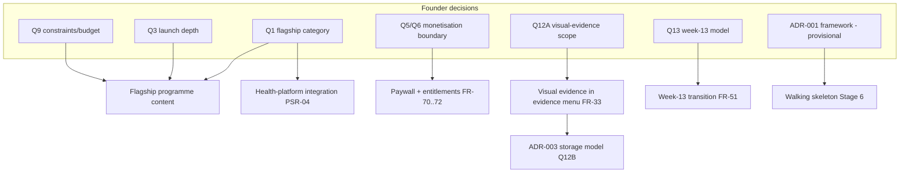
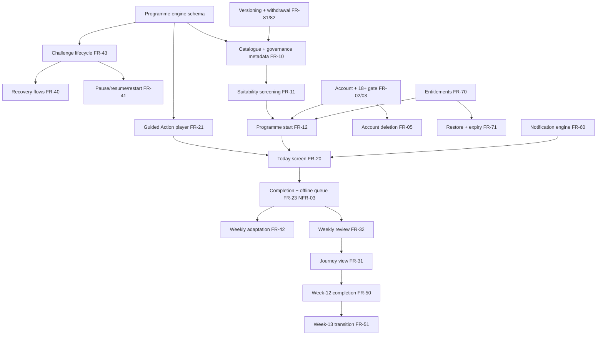

# Feature Dependency Map

**Status:** Draft. Shows what blocks what, so sequencing decisions are made with eyes open. Mermaid source kept editable.

## Decision → capability dependencies

## Capability build order (platform)

## Reading the map — sequencing consequences

1. **The engine schema is the true start line.** Player, catalogue, lifecycle, adaptation and governance all consume it; schema churn after Stage 6 is the most expensive kind. Hence the Gate-2 paper test (four archetypes expressed in schema before any code).
2. **Entitlements sit upstream of programme start**, not bolted on at the end — store review and the Q5/Q6 experiment both need it early (a common failure: billing last, launch blocked).
3. **Recovery flows depend only on lifecycle**, not on adaptation — they ship in the first vertical slice, not as polish (D-002; R-10).
4. **Week-13 (FR-51) is the only M-requirement gated on an unanswered question (Q13)** that sits at the end of a long chain; a v1 (guided next-step choice) is buildable under either Q13 answer, so the decision does not block Stage 6–7 start — it shapes content, not plumbing.
5. **Visual evidence (FR-33) is fully detachable.** Nothing downstream depends on it; if Q12A concludes "not in flagship", the MVP loses nothing structural. This is deliberate (D-003; R-16).
6. **Health integrations (PSR-04) are leaf nodes** — deferable without ripple.

## Content dependencies (often the real critical path)

Flagship programme authoring → expert review → citation pack → demonstration media production → adaptation rules → evidence menu sign-off (Q12A) → week-13 handover content. Content lead-time runs in parallel with Stages 4–6 and historically underestimates worst (R-03): the review cycle alone is weeks, not days.
