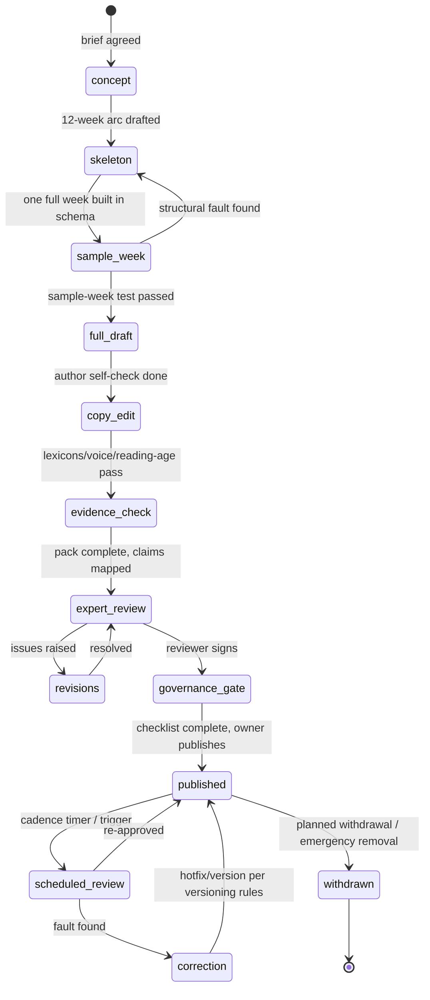

# Content Review Workflow

**Status:** Framework draft for Gate 2. The pipeline that moves a programme from idea to published to retired, with the human checks in the right order. States align with the programme lifecycle (engine §4).

## 1. The pipeline

## 2. The checks, in order and in substance

1. **Sample-week test** (structural): one complete week expressed in the engine schema, walked in a dev build. Catches: schema misfit, day-shape unreality, variant poverty. *Gatekeeper: platform owner.*
2. **Author self-check:** template §12 checklist, honestly.
3. **Copy edit:** voice table, blame/pressure/hype lexicons, reading age ~9–11, age-inclusive language sweep, category-neutrality of any string that touches universal surfaces. *Gatekeeper: copy editor (may be contracted).*
4. **Evidence check:** pack completeness; every claim-bearing sentence keyed to a pack entry with the right tier verb; interpretation-discipline sweep (research-standards §3). *Gatekeeper: evidence editor.*
5. **Expert review:** full artefact + pack; safety, programming/pedagogy soundness, exclusions/contraindications adequacy, claims sanity. Written review record: scope, issues, resolutions, residual limitations, sign-off, next-review date. *Gatekeeper: the named reviewer (governance §2).*
6. **Governance gate:** record complete; accessibility content obligations present; version stamped; publish. *Gatekeeper: platform owner — tooling-enforced, not honour-based.*

## 3. Review SLAs and hygiene

Expert review turnaround agreed per engagement (plan 2–3 weeks; R-03 buffer); review comments tracked to resolution in writing (no verbal sign-offs); a reviewer who requests changes reviews the *changed* artefact (no rubber-stamping deltas); reviewer conflicts of interest declared (e.g. reviewing content that competes with their own practice).

## 4. Post-publish loops

- **Scheduled re-review** per governance §4 cadence.
- **Trigger review** on: user safety report (24h triage), evidence-watch hit, analytics anomaly (adaptation model signals), store policy change.
- **Correction path:** correction → versioning rules → user messaging where material (governance §6).
- **Emergency removal:** owner or reviewer invokes FR-82 kill-switch → authored fallback content serves → incident review within 72h → correction or withdrawal. Drill before launch.

## 5. Roles & authority summary

| Actor | Can | Cannot |
|-------|-----|--------|
| Author | Draft, revise, propose | Publish, self-sign class-2 review |
| Copy editor | Block on language | Alter substance silently |
| Evidence editor | Block on evidence | Waive tier rules |
| Expert reviewer | Block publish; trigger emergency removal | Be overridden on safety within their scope |
| Platform owner | Publish, withdraw, emergency-remove | Ship past a missing mandated signature (tooling-enforced) |

## 6. Records

Everything above writes to the programme's governance record (auditable trail: who checked what, when, outcome — the `AuditEvent` stream in the domain model). The record's user-visible surface is FR-80; its full form is internal but export-ready for any store/regulator conversation.
