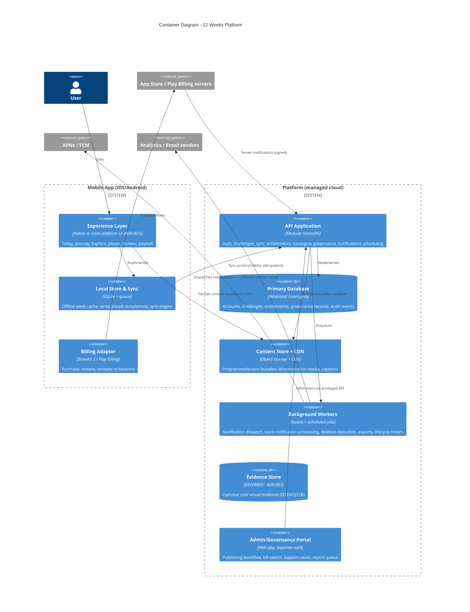

# Container Architecture (C4 Level 2)

**Status:** Draft for Gate 6. Deliberately boring: a modular monolith API, one relational database, managed services — every piece replaceable, none exotic. Microservices are explicitly rejected at this scale (operational cost without benefit; revisit only with evidence).

## Container notes (the decisions inside the boxes)

- **API as modular monolith:** modules mirror the domain (accounts, challenges, content, entitlements, governance, notifications) with enforced internal boundaries — the future seam-lines if scale ever demands extraction. One deployable, one on-call surface.
- **Sync protocol:** delta-based, idempotent, client-clock-sceptical (server assigns authoritative ordering; device timestamps recorded but not trusted for money or state transitions). Conflict rule: user actions are facts, never lost — duplicates reconciled by idempotency keys; the lifecycle state machine resolves ordering.
- **Content bundles:** a ProgrammeVersion compiles to an immutable, content-addressed bundle (structure JSON + media manifest); the app downloads the current week (+lookahead) per NFR-03. Media variants pre-encoded (bitrates/sizes) for low-end honesty. No mixed-version weeks (versioning §5).
- **Entitlement truth:** store server notifications → jobs → entitlement state machine in db → device holds a signed, short-TTL entitlement token with offline grace (subscription-requirements E1–E9).
- **Background workers, not cron sprawl:** one queue, named job types (notification fan-out respects user timezones; deletion executes the retention policy verbatim; export assembly; lifecycle timers for lapse/abandon detection *server-side as backstop* — the device detects first, the server guarantees).
- **Evidence store is a deliberate hole:** drawn as DEFERRED; no code path may assume its existence (D-003; R-16). If Q12A concludes "not in flagship", it simply never gets built.
- **Environments:** local → staging (store sandbox wired) → production; feature flags + remote config from day one (kill-switch FR-82 rides this rail); infra as code; automated backups with restore drills (a backup untested is a hope, not a backup).
- **Observability:** structured logs, error tracking, uptime + queue-depth alerts to the founder's phone; billing-event anomalies page loudest (money + trust).

## Capacity honesty

Founder-scale targets: thousands of users on minimal managed instances; the architecture's job is *correctness under smallness* (idempotency, backups, auditability), not premature scale. Cost envelope estimated at Stage 6 with the vendor decision (Q9 input).
