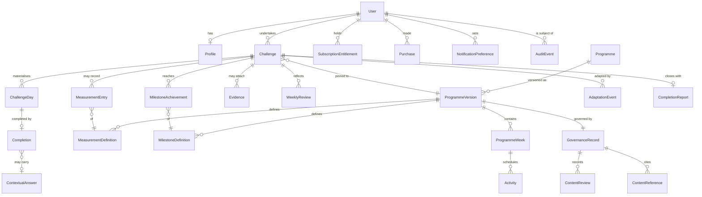

# Domain Model

**Status:** Draft for Gate 2/6. Conceptual entities and relationships — **not a database schema** (that stays unfinalised by instruction). Ownership, versioning and deletion semantics are the load-bearing content here.

## Entity relationship overview

## Entities (essentials only)

**Identity & account**
- `User` — auth identity, email, created/deleted timestamps, consent states (analytics, notifications). Owns everything below the line marked *user-owned*.
- `Profile` — first name, locale/units, accessibility prefs mirrored where server-relevant. Deliberately thin (data minimisation: no age beyond 18+ attestation, no gender, no body data at account level — programme-level data lives with challenges).

**Content (platform-owned)**
- `Programme` — stable identity (slug, archetype); catalogue presence.
- `ProgrammeVersion` — immutable published artefact (schema per engine §2); content-addressed bundle ref; MAJOR.MINOR.PATCH; state (published/deprecated/withdrawn).
- `ProgrammeWeek`, `Activity` — structure per engine; `Activity` carries the GuidedAction definition incl. variants and completion model.
- `MeasurementDefinition`, `MilestoneDefinition` — per-version definitions (D-003: definitions live with content, entries live with the user).
- `GovernanceRecord` — author, reviewer(+credentials), review dates, evidence-pack ref, withdrawal state; `ContentReview` — each review event (scope, issues, resolution, signature); `ContentReference` — citations (research-standards format).

**Journey (user-owned)**
- `Challenge` — user × ProgrammeVersion; lifecycle state; schedule shape; goal wording (user's words — sensitive-adjacent, user-owned); start/pause/completion timestamps.
- `ChallengeDay` — materialised calendar of the challenge (role, scheduled date, state); the unit lapse-detection reads.
- `Completion` — the fact of a done day: variant used, completion model payload, offline-origin flag, idempotency key.
- `ContextualAnswer` — micro-question answers, keyed to declared purpose (safety/difficulty/guidance/evidence) — purpose limitation carried *in the data model* so misuse is structurally visible.
- `MeasurementEntry`, `Evidence`, `WeeklyReview` (structured answers + optional free text), `MilestoneAchievement`, `AdaptationEvent` (rule fired, what changed, user accepted/declined), `CompletionReport` (assembled artefact + the version it renders from).

**Commerce**
- `Purchase` — store transaction record (store, product, original-transaction id, verification state) — financial record class.
- `SubscriptionEntitlement` — derived current truth (product class, term, state: active/grace/hold/expired, source events) — the thing the app asks about.

**Platform**
- `NotificationPreference` — per-type enablement + times (the FR-60 contract).
- `AuditEvent` — append-only: account events, entitlement transitions, governance actions, admin access, deletion execution. The trust ledger.

## Ownership & deletion semantics (the part that matters legally)

| Class | Owner | On account deletion |
|-------|-------|--------------------|
| User, Profile, Challenge tree (days, completions, answers, measurements, evidence, reviews, reports), NotificationPreference | **User** | Erased (FR-05) per retention-and-deletion timelines; evidence media erased from storage, not just unlinked |
| Purchase records | User-linked financial record | Pseudonymised financial minimum retained per legal-records requirement (retention policy names the period and fields) — never usable for anything else |
| Analytics events | Pseudonymous | Analytics ID unlinked + erased per spec |
| Programme/GovernanceRecord tree | Platform | Untouched (contains no user data) |
| AuditEvent | Platform (legal) | User-subject events pseudonymised, retained per audit retention window |

## Versioning semantics

Users pin to `ProgrammeVersion` (engine §8); `CompletionReport` renders against its pinned version forever (reproducibility); adaptation events record the rule *version* that fired (adaptation is auditable); governance records version with content (a review signs a specific artefact hash).

## Integrity rules worth naming now

One active `Challenge` per user (lifecycle §4) enforced at domain level; `Completion` idempotency (device retries never double-complete); `ChallengeDay` materialisation is schedule-shift-safe (pause/reshape rewrites future days only — history is immutable); `Evidence` rows cannot exist without their challenge's programme declaring the evidence type (D-003 structurally enforced).
