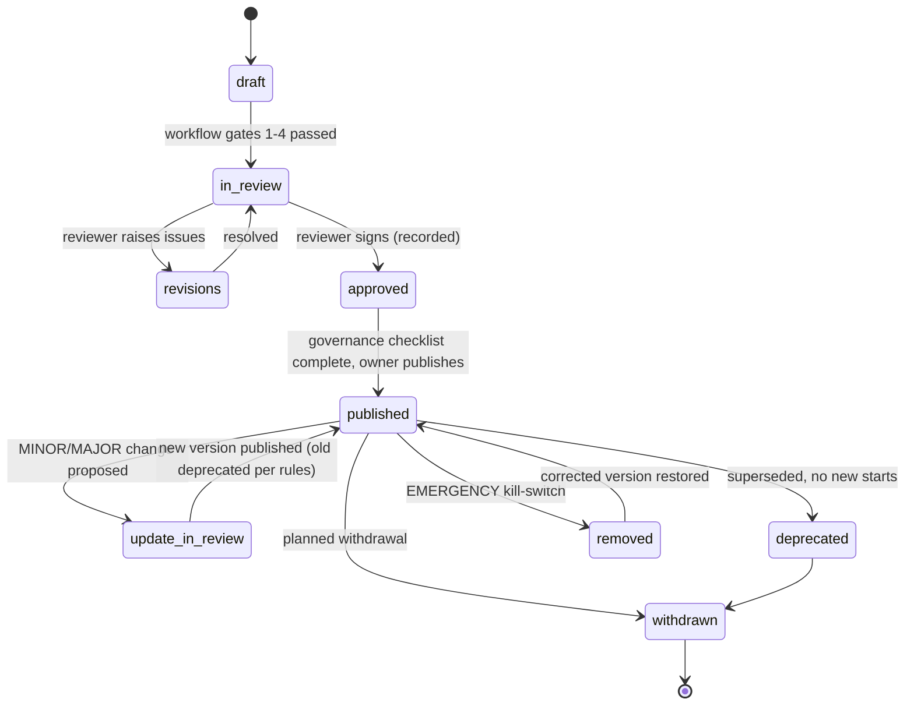
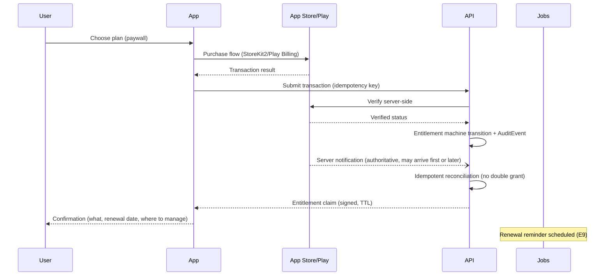
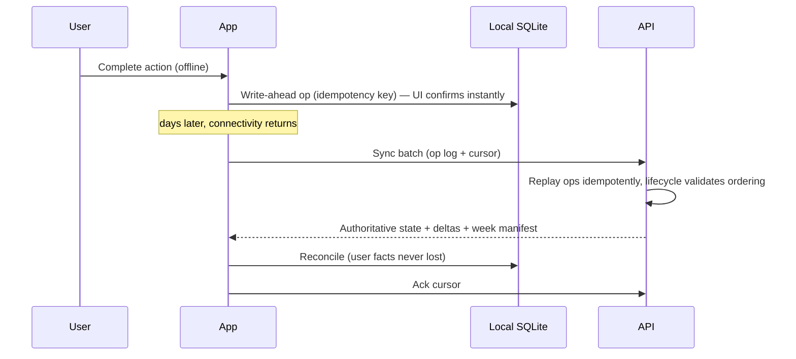
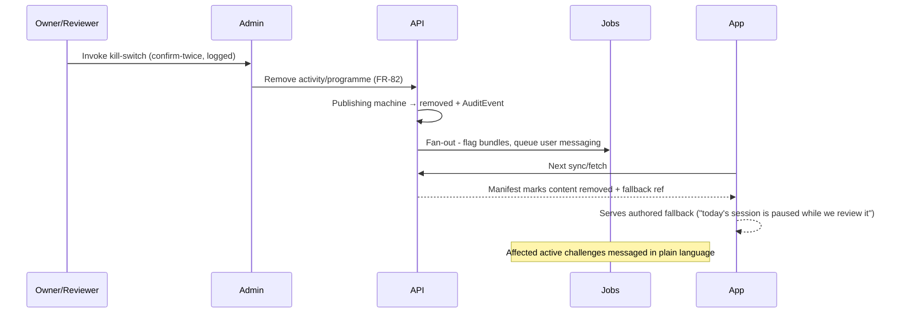
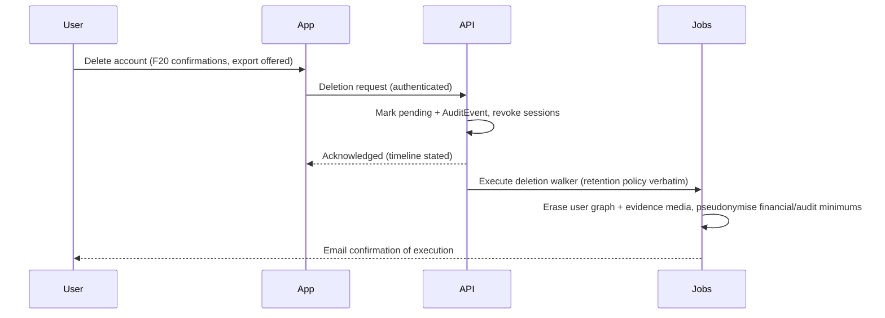

# State Machines & Critical Sequences

**Status:** Draft for Gate 6. The three machines that carry correctness (challenge, programme publishing, entitlement) plus the sequences where money, safety or data could be lost. Application code enforces these; nothing else writes state (data-model commandment 5).

## 1. Challenge lifecycle

Canonical machine in [`01-product/challenge-lifecycle.md`](../../docs/01-product/challenge-lifecycle.md) §2 (Mermaid there; single source — not duplicated to avoid drift). Architectural obligations: transitions are server-validated commands (api §1); device-side detection (lapse) is advisory until server confirmation; every transition appends an `AuditEvent`; timers (7d/21d/28d) run server-side as the guarantee layer.

## 2. Programme publishing



Tooling enforcement: `approved` unreachable without a `ContentReview` row signed by a qualified reviewer for class-2 content (governance §7 — structural, not procedural); `removed` triggers fallback-content serving + affected-user messaging jobs atomically.

## 3. Entitlement machine (the server's *derived* entitlement model — provisional)

**Not "billing truth": the stores are the billing truth.** This machine is the server's entitlement model *derived from* verified store events, and it is provisional until store configuration is verified at Stage 2 (R-20 SKU-shape check; R-21 pause/term-billing collision). States marked † exist only if the Q5/Q6 decisions configure them.

```mermaid
stateDiagram-v2
    [*] --> none
    none --> trial: verified trial start †
    none --> active: verified purchase (server notification / verified receipt)
    trial --> intro: converts at intro price †
    trial --> active: converts at full price
    trial --> expired: trial lapses unconverted
    intro --> active: intro period completes
    active --> grace: renewal payment failed (store grace window)
    grace --> active: payment recovered
    grace --> billing_retry: grace exhausted, store retrying (Play hold / App Store billing retry)
    billing_retry --> active: recovered
    billing_retry --> expired: retries exhausted
    active --> paused: user pauses subscription (Play-only feature) †
    paused --> active: pause ends or user resumes
    paused --> expired: pause lapses unresumed
    active --> expired: cancellation reaches term end
    active --> revoked: refund / chargeback
    expired --> restored: restore purchases (receipt re-verification, same store account)
    restored --> active: entitlement re-established
    expired --> active: repurchase / resubscribe (eligible-repurchase path; win-back honesty rules apply)
    revoked --> [*]
```

Rules: transitions driven **only** by verified store server events (App Store Server Notifications / Play RTDN) or server-verified receipts; client receipt submission is a hint, never truth; every transition audited; device tokens carry short-TTL entitlement claims with offline grace ≥ store grace (F18 honesty); `revoked` messaging is factual, never punitive; `trial`/`intro` follow the honest-intro posture (Q5 — store-native pricing, no countdown theatre). **R-21 seam, stated where users will feel it:** a *challenge* pause (F14) does not pause *billing*, and Play's subscription pause does not pause the challenge — the two pauses are different objects, and every pause surface says which one it is in plain words.

## 4. Critical sequences

### 4.1 Purchase (the money path)


### 4.2 Offline week → sync (the data path)


### 4.3 Emergency content removal (the safety path)


### 4.4 Account deletion (the trust path)


## 5. Invariants under test (Gate-6/8 checklist hooks)

No path grants entitlement without server verification · no sequence loses a user fact on crash/retry/conflict · kill-switch propagates ≤ one sync cycle · deletion walker terminates and proves coverage (schema-generated — data-model commandment 6) · every diagram above has an automated test twin (quality strategy).
