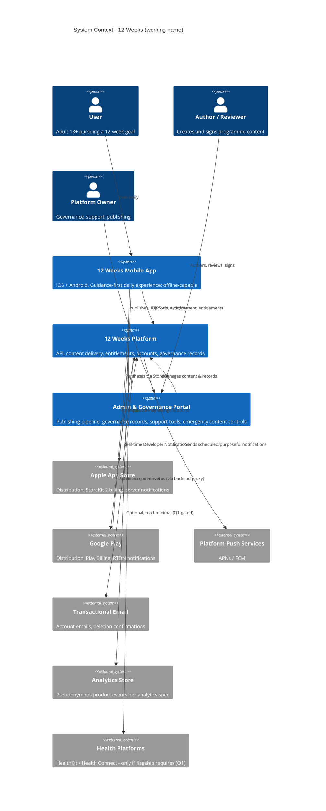

# System Context (C4 Level 1)

**Status:** Draft for Gate 2/6. Conceptual architecture — no vendor commitments (Deferred technical decisions listed at end). Sized honestly for a founder-led product: boring, managed, replaceable parts.

## Context diagram

## System responsibilities (boundaries that matter)

- **Mobile app** owns the experience and the offline week: current ProgrammeVersion content cached; completions/answers written locally first (write-ahead, NFR-06), synced opportunistically. The app never trusts itself on entitlements long-term (server-verified with cached grace).
- **Platform (backend)** owns truth: accounts, challenge state reconciliation, entitlement verification (store server notifications are the source of billing truth — never client receipts alone), programme content versions, governance records, notification scheduling, audit trail, deletion execution.
- **Admin/governance portal** owns the content pipeline (workflow states from content-review-workflow), the emergency kill-switch (FR-82), support lookup (least-privilege views), and report handling — the operational back of house that makes governance real rather than documentary.
- **Analytics** is a *consumer* of pseudonymous events routed via the backend (proxying keeps raw device identifiers and IPs out of third-party hands and makes consent enforcement server-verifiable).

## Trust boundaries

1. Device ↔ platform: authenticated TLS; tokens in platform keystores; the device holds the user's week and queued writes.
2. Platform ↔ stores: signed server notifications verified; entitlement state machine driven only by verified events.
3. Platform ↔ analytics/mail vendors: minimum-necessary payloads; no sensitive content categories ever cross (analytics spec prohibitions enforced at the proxy).
4. Admin: separate authentication, role-based (author ≠ publisher powers), full audit logging; emergency powers behind two-person confirmation where feasible (founder-scale honest version: confirm-twice + logged).

## Deferred technical decisions (tracked, not made)

Cloud/hosting vendor; database engine (relational assumed conceptually); analytics vendor (self-hosted vs privacy-SaaS); email vendor; mobile framework (ADR-001, provisional); content pipeline tooling (ADR-002); evidence storage model (ADR-003 — deliberately unresolved pending Q12A/Q12B).
